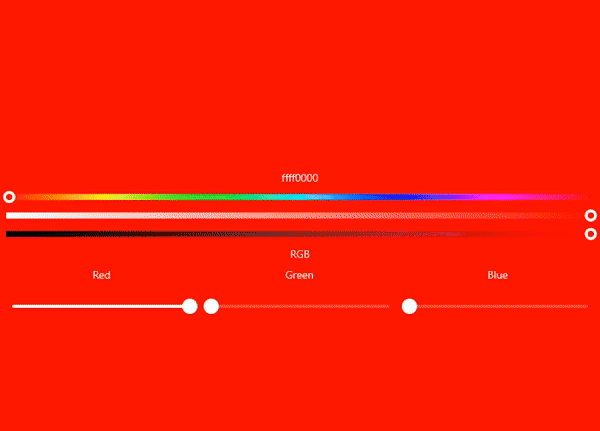

<h1 align="center">Compose Color Slider</h1>

<br>

<div align="center" style="display: grid; justify-content: center;">

|                                                                  🌟                                                                   |                  Support this project                   |               
|:-------------------------------------------------------------------------------------------------------------------------------------:|:-------------------------------------------------------:|
|    | <code>bc1qs6qq0fkqqhp4whwq8u8zc5egprakvqxewr5pmx</code> | 
|  | <code>0x3147bEE3179Df0f6a0852044BFe3C59086072e12</code> |
|     |     <code>TKznmR65yhPt5qmYCML4tNSWFeeUkgYSEV</code>     |

</div>

<br>

<p align="center">This is a component that allows you to select a color component of the HSV model and contains three corresponding sliders: hue, saturation, and value(brightness)</p>

<br>

<p align="center"></p>

## Installation

```
repositories {
    maven("https://jitpack.io")
}

dependencies {
    implementation("com.github.numq:compose-color-slider:1.0.1")
}
```
